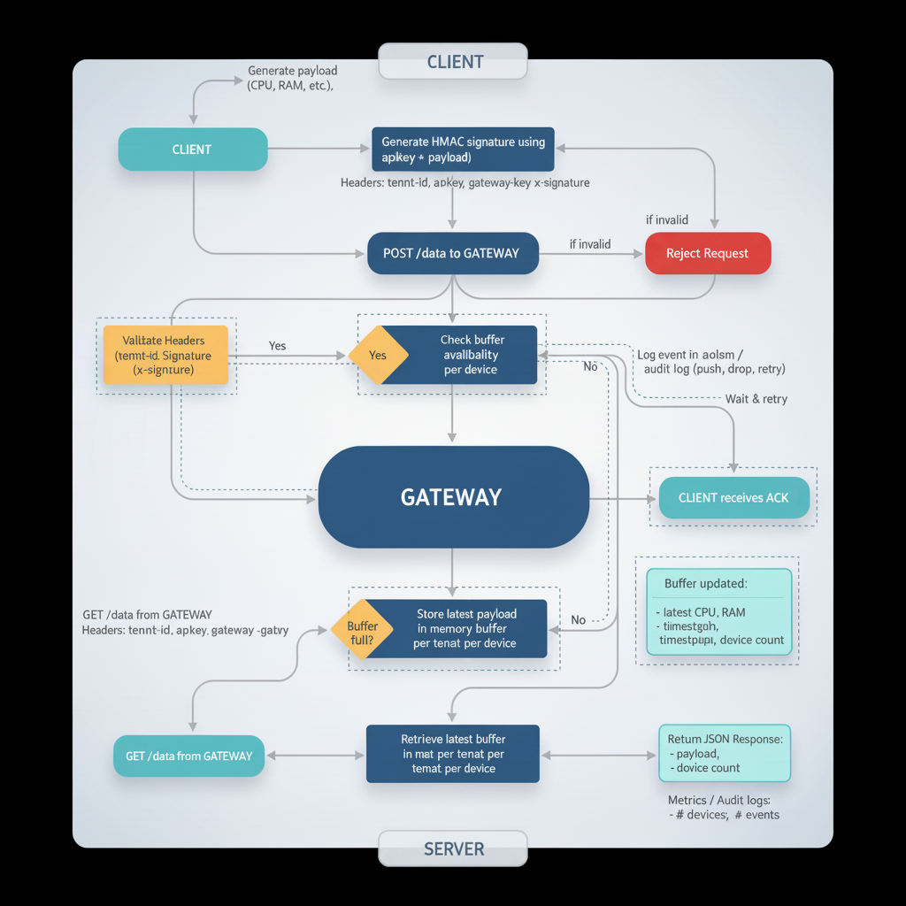

# Gatemons [EN](./README.md)

<center></center>

Arsitektur ini memungkinkan **beberapa tenant (pelanggan)** untuk mengirim data dari berbagai perangkat secara aman ke satu gateway, sementara server dapat mengambil data per tenant tanpa risiko data tercampur.

```
CLIENT POST → GATEWAY ← GET SERVER
```

**Catatan:** Gateway **tidak menyimpan data secara permanen** — hanya menjaga **buffer sementara di memori per tenant per device**, selalu menimpa data lama. Cocok untuk monitoring real-time CPU, RAM, dan status perangkat.

> Karena **gateway adalah pusat (hub)** dari arsitektur ini, **client dan server bebas menggunakan teknologi atau bahasa pemrograman apapun**. Yang penting mereka mengikuti protokol HTTP API gateway dan mengirim header serta payload sesuai aturan (`tenant-id`, `apikey`, `gateway-key`, `x-signature`).

---

## 🧱 Komponen Sistem

| Folder     | Fungsi                                                                   |
| ---------- | ------------------------------------------------------------------------ |
| `client/`  | Mengirim data perangkat ke gateway                                       |
| `gateway/` | Memvalidasi tenant, memverifikasi signature HMAC, menyimpan data terbaru |
| `server/`  | Mengambil data dari gateway dan menyediakan API/dashboard                |

---

## 🔐 Mekanisme Keamanan

Setiap **POST/GET** request ke gateway harus menyertakan header berikut:

| Header        | Deskripsi                                             |
| ------------- | ----------------------------------------------------- |
| `tenant-id`   | ID tenant                                             |
| `apikey`      | API key tenant                                        |
| `gateway-key` | Secret key global gateway (.env)                      |
| `x-signature` | HMAC SHA256 signature dari payload (wajib untuk POST) |

> Jika salah satu header atau signature tidak valid, gateway **menolak request**.

---

## 📝 Fitur

* Verifikasi signature HMAC per POST request
* Middleware auth (`tenant-id`, `apikey`, `gateway-key`)
* Rate limiting per tenant
* Queue async untuk operasi push per tenant
* Mekanisme retry saat buffer penuh
* Batas buffer per tenant dapat dikonfigurasi (`MAX_BUFFER`)
* Pembersihan data otomatis (TTL default 24 jam)
* Audit log untuk event push, pull, enqueue, drop per tenant
* Buffer per device → **tidak ada duplikasi device**
* Selalu mengembalikan **status terbaru** tanpa menghapus buffer
* Menampilkan jumlah device per tenant
* Metrics
* Audit log per tenant
* Pembersihan otomatis setiap 10 menit
* Event loop non-blocking
* Penanganan aman untuk tenant tanpa data

---

## 📌 Alur Data

1. ⏩ **Client** mengirim data monitoring (CPU, RAM, dll) setiap 5 detik
2. 🧠 **Gateway** memvalidasi header dan signature, lalu memperbarui **status terbaru per device**
3. 💾 Gateway menyimpan data di **memori** (tanpa database)
4. 🔁 **Server** mengambil data dari gateway secara periodik

**Keunggulan:** Streaming real-time penuh tanpa penyimpanan permanen atau duplikasi data.

---

## ⚙ Instalasi & Menjalankan

### 1️⃣ Gateway

```bash
cd gateway
npm install
npm run dev
```

Gateway tersedia di:

```
http://localhost:3000
```

### 2️⃣ Client

```bash
cd client
npm install
node index.js
```

Client akan membuat **signature HMAC** dan mengirim data setiap 5 detik.

### 3️⃣ Server

```bash
cd server
npm install
npm start
```

Route server untuk mengambil data:

```
GET http://localhost:4000/data
```

---

## 🔍 Contoh Request & Response

### Client POST → Gateway

```
POST /data
Headers:
  tenant-id: TENANT01
  apikey: ABC123
  gateway-key: GATEWAY-API-SECRET
  x-signature: <HMAC-SIGNATURE>

Body:
{
  "device": "Device_A",
  "cpu": 76.44,
  "ram": 62.18
}
```

### Server GET → Gateway

```
GET /data
```

Response:

```json
{
  "success": true,
  "data": [
    {
      "payload": { "device": "Device_A", "cpu": 76.44, "ram": 62.18 },
      "timestamp": 1732807609921
    }
  ]
}
```

### GET /metrics → Gateway

```
GET /data/metrics
```

Response:

```json
{
  "tenant": 1,
  "device": 1
}
```

---

## 🧠 Keunggulan Last State & Fitur Lanjutan

| Fitur                  | Deskripsi                                                |
| ---------------------- | -------------------------------------------------------- |
| HMAC Verified          | Menjamin integritas payload                              |
| Lightweight            | Tidak menggunakan DB permanen, hanya snapshot per device |
| Realtime               | Data selalu up-to-date                                   |
| Non-Duplicated Devices | Setiap device hanya memiliki 1 payload terbaru           |
| Async & Retry          | Non-blocking, retry otomatis jika buffer penuh           |
| Audit Logging          | Melacak aktivitas tenant                                 |
| Scalable               | Menangani ribuan tenant di memori                        |
| Minimal RAM            | Hanya menyimpan state terakhir per device                |

Cocok untuk:

* Monitoring CPU / RAM / Network
* Status perangkat IoT
* Telemetry devices
* Monitoring kesehatan mesin industri